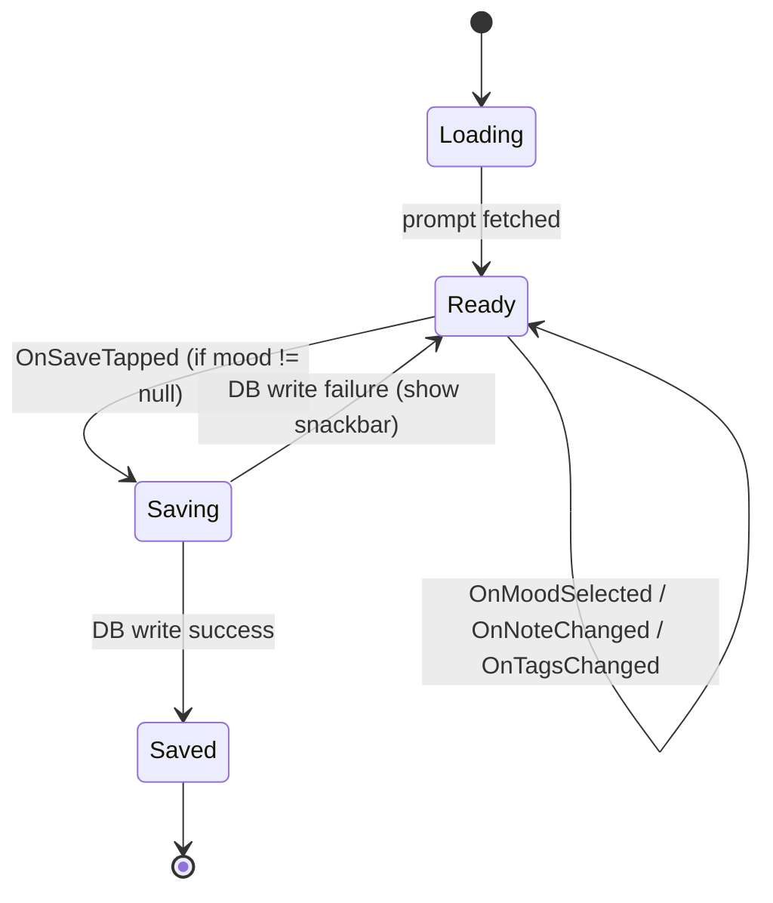

# Check-In State Machine

## State Diagram

## Transition Table

| Current State | Event                 | Guard / Notes                 | Next State                                     |
| ------------- | --------------------- | ----------------------------- | ---------------------------------------------- |
| Loading       | *prompt fetched ✓*    | Prompt + streak data loaded   | Ready(prompt, null, "", [])                   |
| Ready         | `OnMoodSelected(m)`   | —                             | Ready(prompt, m, note, tags)                   |
| Ready         | `OnNoteChanged(txt)`  | —                             | Ready(prompt, mood, txt, tags)                 |
| Ready         | `OnTagsChanged(list)` | —                             | Ready(prompt, mood, note, list)                |
| Ready         | `OnSaveTapped`        | **mood != null**              | Saving                                         |
| Ready         | `OnSaveTapped`        | mood == null (invalid)        | Ready (no transition, maybe show toast)        |
| Saving        | DB write success      | —                             | Saved(entryId)                                 |
| Saving        | DB write failure      | —                             | Ready(previous data) + side-effect: show error |
| Saved         | `OnNavigateConsumed`  | After nav to Timeline handled | Ready(newPrompt, null, "", [])                |
| Saved         | —                     | (No further UI events)        | —                                              |

## Usage Notes

* **ViewModel** produces a `StateFlow<CheckInUiState>`.
* UI should disable inputs while state == `Saving`.
* Upon `Saved`, NavController pops to Timeline, then emits `OnNavigateConsumed` to reset.